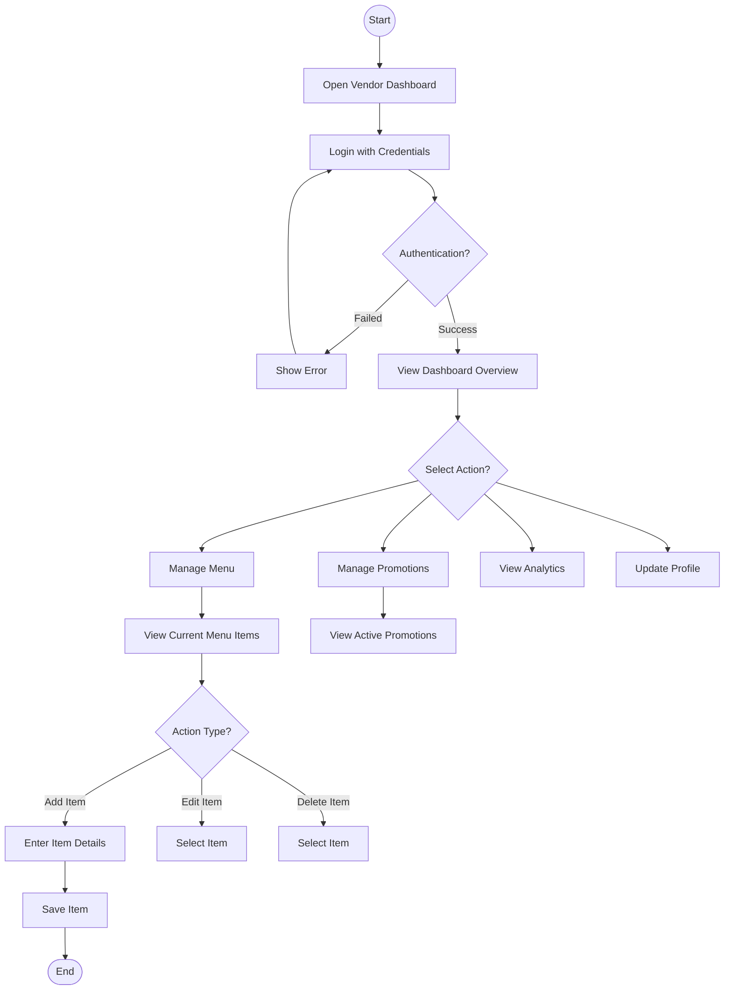
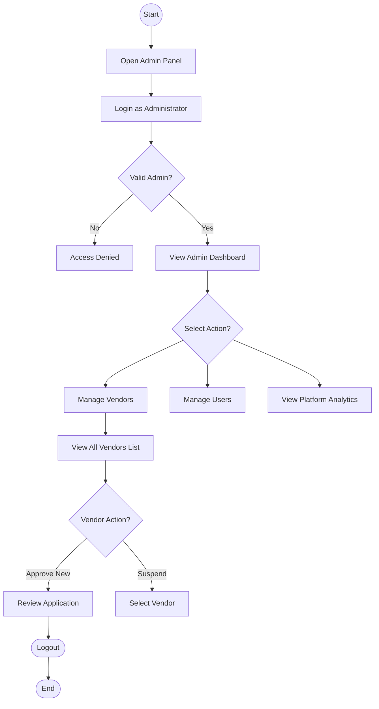

# StreetBite - Technical Diagrams

## Generated Diagram Images

All diagrams are available in the `diagrams/` folder. These diagrams are optimized for A4 academic reports (High resolution, B&W/Grayscale).

| # | Filename | Description |
|:-:|----------|-------------|
| 1 | `01_usecase.png` | **Use Case Diagram** (All Roles) |
| 2 | `02_activity_customer.png` | **Activity Diagram - Customer** (Comprehensive) |
| 3 | `03_activity_vendor.png` | **Activity Diagram - Vendor** (Comprehensive) |
| 4 | `04_activity_admin.png` | **Activity Diagram - Admin** (Comprehensive) |
| 5 | `05_dfd_level0.png` | **DFD Level 0** (Context Diagram) |
| 6 | `06_dfd_level1.png` | **DFD Level 1** (Comprehensive System Overview) |
| 7 | `07_dfd_level2_core.png` | **DFD Level 2** (Core Business Flow - Search to Review) |
| 8 | `09_seq_customer_journey.png` | **Sequence - Customer** (Complete End-to-End Journey) |
| 9 | `11_seq_vendor_journey.png` | **Sequence - Vendor** (Complete Operations Cycle) |
| 10 | `13_seq_admin_journey.png` | **Sequence - Admin** (Complete Management Cycle) |
| 11 | `14_architecture.png` | **System Architecture** |
| 12 | `15_er_diagram.png` | **ER Diagram** (Database Design) |

---

## Diagram Source Code (Mermaid)

### 1. Use Case Diagram

*(See `diagrams/01_usecase.png`)*

### 2. Activity Diagrams

#### 2.1 Customer Activity

*(See `diagrams/02_activity_customer.png`)*

#### 2.2 Vendor Activity

#### 2.3 Admin Activity

---

*(Remaining DFD and Sequence diagrams are unchanged)*
