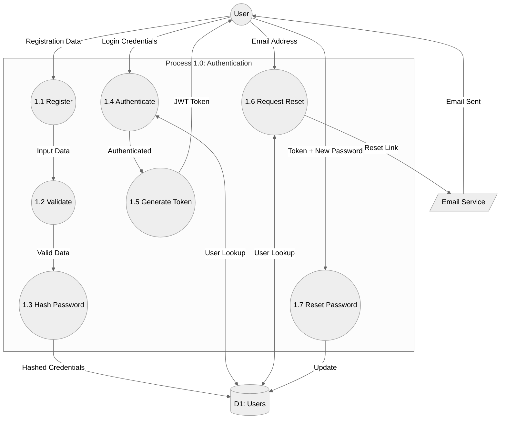
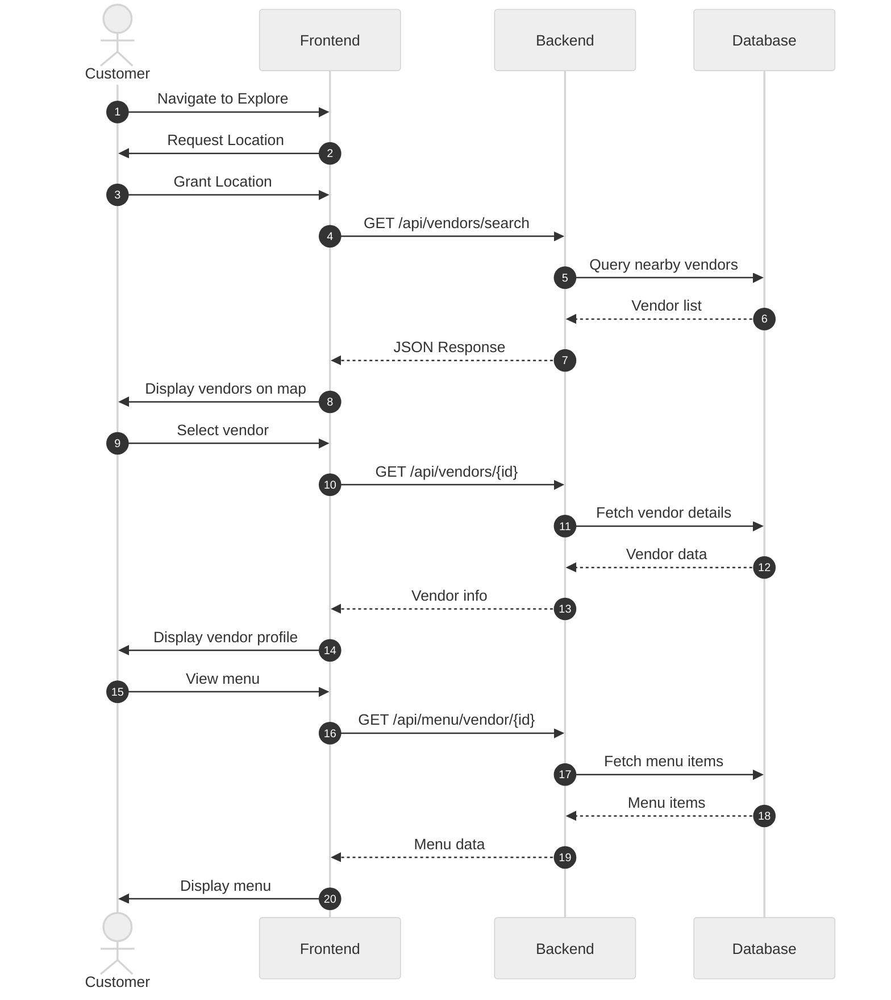
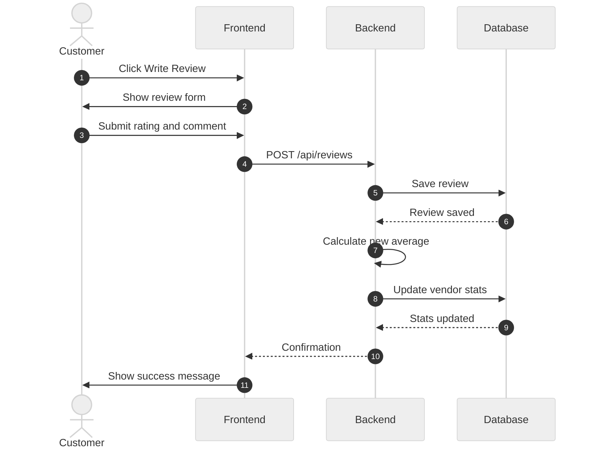
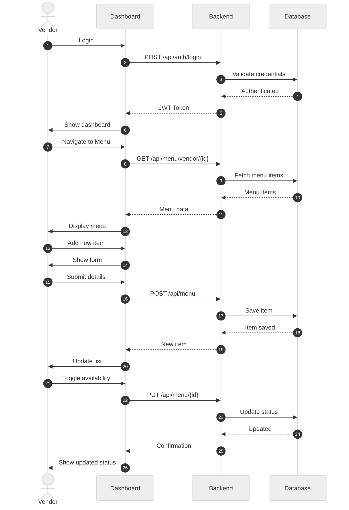
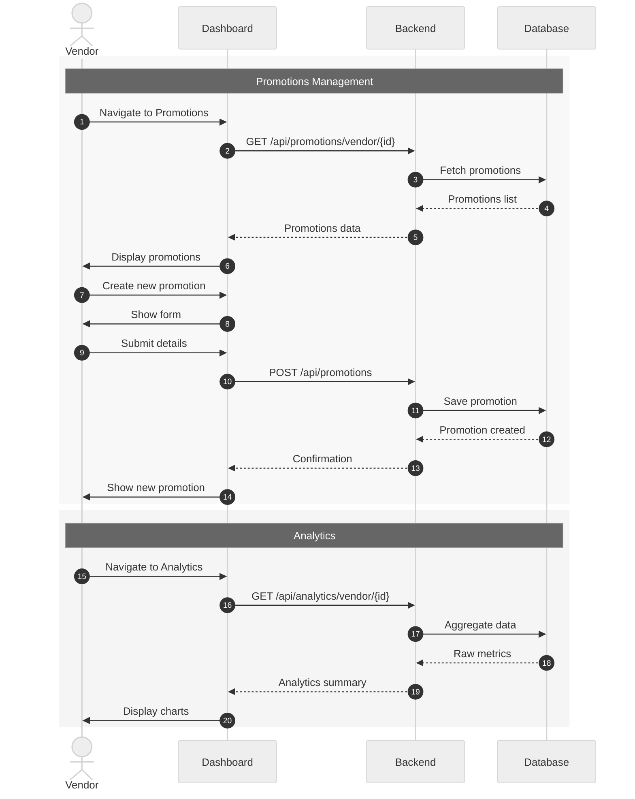
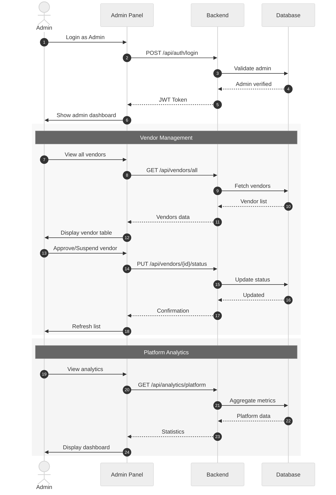

# 🍽️ StreetBite - Project Report

**Project**: StreetBite - Street Food Discovery Platform  
**Document Type**: Technical System Design  
**Date**: October 2024  
**Format**: A4 Professional Print

---

## 1. Project Overview

**StreetBite** is a full-stack street food discovery platform connecting food lovers with local vendors. The system focuses on **discovery and engagement**, allowing users to find vendors, view menus, and share reviews.

### Core Features (Discovery Only)
- **📍 Location-Based Search**: Find vendors using real-time geolocation.
- **🍔 Menu Browsing**: View detailed menus with prices and availability.
- **⭐ Reviews & Ratings**: Community-driven review system.
- **🏪 Vendor Dashboard**: Tools for vendors to manage profiles and menus.
- **📊 Analytics**: Insights on profile views and menu engagement.

> **Note**: This platform is purely for discovery. Order placement and payment processing are out of scope for this version.

---

## 2. System Architecture

### 2.1 Use Case Diagram

The system involves three primary actors: **Customer**, **Vendor**, and **Admin**.

**Key Use Cases:**
- **Customer**: Search Vendors, View Menu, Write Review, Add Favorites.
- **Vendor**: Manage Profile, Manage Menu, Create Promotions, View Analytics.
- **Admin**: Manage Vendors, Platform Analytics.

---

### 2.2 Activity Diagram - Vendor Discovery Flow

The primary user journey focuses on discovering vendors and engaging with content.

1. **Authentication**: User logs in (optional for basic search).
2. **Discovery**: User enables location -> System finds nearby vendors.
3. **Engagement**: User views details -> writes review or adds to favorites.

---

## 3. Data Flow Diagrams (DFD)

### 3.1 DFD Level 0 - Context Diagram

System interaction with external entities (Users, Google Maps, Email Service).

---

### 3.2 DFD Level 1 - Major Processes

Breakdown of the 7 core system processes:

1. **Authentication**
2. **Vendor Management**
3. **Menu Management**
4. **Review Management**
5. **Promotion Management**
6. **Analytics**
7. **Favorites**

---

### 3.3 DFD Level 2 - Review Management

Detailed flow of the Review Management process (Process 4.0).

---

### 3.4 DFD Level 2 - Authentication

Detailed flow of the Authentication process (Process 1.0).

---

## 4. Sequence Diagrams

### 4.1 Customer: Vendor Discovery

Interaction flow for finding vendors and viewing menus.

---

### 4.2 Customer: Write Review

Flow for submitting a review and updating statistics.

---

### 4.3 Vendor: Menu Management

Vendor operations for managing menu items.

---

---

### 4.4 Vendor: Promotions & Analytics

Vendor operations for managing promotions and viewing analytics.

---

### 4.5 Admin: Platform Management

Admin operations for managing vendors and viewing insights.

---

## 5. Technology Stack

- **Frontend**: Next.js 16 (React 19), TypeScript, Tailwind CSS
- **Backend**: Spring Boot 3.2.0, Java 17
- **Database**: Firebase Firestore (NoSQL)
- **Services**: Google Maps API (Geocoding), Resend (Email)
- **Hosting**: Vercel (Frontend), Render (Backend)

---

**End of Report**
