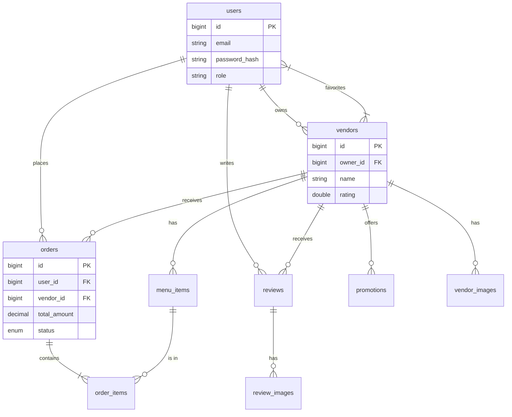

# Database Table Layout

This document outlines the database schema for the StreetBite application. The database is MySQL.

## Overview

The database consists of the following main tables:
- **users**: Stores customer, vendor, and admin accounts.
- **vendors**: Stores vendor business profiles.
- **menu_items**: Stores food items offered by vendors.
- **orders**: Stores customer orders.
- **order_items**: Stores items within an order.
- **reviews**: Stores customer reviews for vendors.
- **promotions**: Stores vendor promotional offers.
- **user_favorites**: Stores user's favorite vendors.
- **vendor_images**: Stores gallery images for vendors.
- **review_images**: Stores images attached to reviews.
- **geocode_cache**: Caches Google Maps API responses.

---

## Table Definitions

### 1. users
Stores all user accounts. Authentication is handled via `email` and `password_hash` (BCrypt).

| Column | Type | Constraints | Description |
| :--- | :--- | :--- | :--- |
| `id` | BIGINT | PRIMARY KEY, AUTO_INCREMENT | Unique user ID |
| `email` | VARCHAR(255) | UNIQUE, NOT NULL | User email address |
| `password_hash` | VARCHAR(255) | NOT NULL | BCrypt password hash |
| `display_name` | VARCHAR(255) | | User's full name |
| `phone_number` | VARCHAR(50) | | Contact number |
| `role` | ENUM | NOT NULL, DEFAULT 'USER' | 'USER', 'VENDOR', 'ADMIN' |
| `created_at` | TIMESTAMP | DEFAULT CURRENT_TIMESTAMP | Account creation time |
| `updated_at` | TIMESTAMP | ON UPDATE CURRENT_TIMESTAMP | Last update time |

### 2. vendors
Stores vendor business details. Linked to a `users` record (the owner).

| Column | Type | Constraints | Description |
| :--- | :--- | :--- | :--- |
| `id` | BIGINT | PRIMARY KEY, AUTO_INCREMENT | Unique vendor ID |
| `owner_id` | BIGINT | FK -> users(id) | The user who owns this vendor profile |
| `name` | VARCHAR(255) | NOT NULL | Business name |
| `description` | TEXT | | Business description |
| `cuisine` | VARCHAR(255) | | Type of cuisine (e.g., "Indian", "Chinese") |
| `address` | VARCHAR(500) | | Physical address |
| `latitude` | DOUBLE | | GPS Latitude |
| `longitude` | DOUBLE | | GPS Longitude |
| `rating` | DOUBLE | DEFAULT 0.0 | Average rating |
| `phone` | VARCHAR(50) | | Business phone number |
| `hours` | VARCHAR(255) | | Operating hours |
| `is_active` | BOOLEAN | DEFAULT TRUE | Whether the vendor is currently active |
| `created_at` | TIMESTAMP | DEFAULT CURRENT_TIMESTAMP | Profile creation time |
| `updated_at` | TIMESTAMP | ON UPDATE CURRENT_TIMESTAMP | Last update time |

### 3. menu_items
Food items available for purchase.

| Column | Type | Constraints | Description |
| :--- | :--- | :--- | :--- |
| `id` | BIGINT | PRIMARY KEY, AUTO_INCREMENT | Unique item ID |
| `vendor_id` | BIGINT | FK -> vendors(id) | The vendor offering this item |
| `name` | VARCHAR(255) | NOT NULL | Item name |
| `description` | TEXT | | Item description |
| `price` | DECIMAL(10, 2) | NOT NULL | Price in INR |
| `category` | VARCHAR(100) | | Category (e.g., "Main Course") |
| `image_url` | VARCHAR(500) | | URL to item image |
| `is_available` | BOOLEAN | DEFAULT TRUE | Availability status |
| `created_at` | TIMESTAMP | DEFAULT CURRENT_TIMESTAMP | Creation time |
| `updated_at` | TIMESTAMP | ON UPDATE CURRENT_TIMESTAMP | Last update time |

### 4. orders
Customer orders.

| Column | Type | Constraints | Description |
| :--- | :--- | :--- | :--- |
| `id` | BIGINT | PRIMARY KEY, AUTO_INCREMENT | Unique order ID |
| `user_id` | BIGINT | FK -> users(id) | The customer who placed the order |
| `vendor_id` | BIGINT | FK -> vendors(id) | The vendor receiving the order |
| `total_amount` | DECIMAL(10, 2) | NOT NULL | Total cost of the order |
| `status` | ENUM | DEFAULT 'PENDING' | 'PENDING', 'PREPARING', 'READY', 'COMPLETED', 'CANCELLED' |
| `created_at` | TIMESTAMP | DEFAULT CURRENT_TIMESTAMP | Order placement time |

### 5. order_items
Individual items within an order.

| Column | Type | Constraints | Description |
| :--- | :--- | :--- | :--- |
| `id` | BIGINT | PRIMARY KEY, AUTO_INCREMENT | Unique record ID |
| `order_id` | BIGINT | FK -> orders(id) | The order this item belongs to |
| `menu_item_id` | BIGINT | FK -> menu_items(id) | The specific menu item ordered |
| `quantity` | INT | NOT NULL, DEFAULT 1 | Quantity ordered |
| `price_at_time` | DECIMAL(10, 2) | NOT NULL | Price per unit at the time of order |

### 6. promotions
Vendor promotional offers.

| Column | Type | Constraints | Description |
| :--- | :--- | :--- | :--- |
| `id` | BIGINT | PRIMARY KEY, AUTO_INCREMENT | Unique promotion ID |
| `vendor_id` | BIGINT | FK -> vendors(id) | The vendor offering the promotion |
| `title` | VARCHAR(255) | NOT NULL | Promotion title |
| `description` | TEXT | | Details |
| `discount_type` | ENUM | | 'PERCENTAGE' or 'FIXED' |
| `discount_value` | DECIMAL(10, 2) | | Value of the discount |
| `start_date` | TIMESTAMP | | Start time |
| `end_date` | TIMESTAMP | | Expiry time |
| `is_active` | BOOLEAN | DEFAULT TRUE | Whether the promotion is active |
| `created_at` | TIMESTAMP | DEFAULT CURRENT_TIMESTAMP | Creation time |

### 7. reviews
Customer reviews.

| Column | Type | Constraints | Description |
| :--- | :--- | :--- | :--- |
| `id` | BIGINT | PRIMARY KEY, AUTO_INCREMENT | Unique review ID |
| `vendor_id` | BIGINT | FK -> vendors(id) | The vendor being reviewed |
| `user_id` | BIGINT | FK -> users(id) | The reviewer |
| `rating` | INT | CHECK (1-5) | Star rating |
| `comment` | TEXT | | Review text |
| `created_at` | TIMESTAMP | DEFAULT CURRENT_TIMESTAMP | Review time |

### 8. user_favorites
Many-to-Many relationship for favorite vendors.

| Column | Type | Constraints | Description |
| :--- | :--- | :--- | :--- |
| `user_id` | BIGINT | FK -> users(id), PK | User ID |
| `vendor_id` | BIGINT | FK -> vendors(id), PK | Vendor ID |
| `created_at` | TIMESTAMP | DEFAULT CURRENT_TIMESTAMP | When favorited |

### 9. vendor_images & review_images
Storage for image URLs.

| Table | Column | Type | Description |
| :--- | :--- | :--- | :--- |
| `vendor_images` | `vendor_id` | FK -> vendors(id) | Linked vendor |
| `vendor_images` | `image_url` | VARCHAR(500) | Image URL |
| `review_images` | `review_id` | FK -> reviews(id) | Linked review |
| `review_images` | `image_url` | VARCHAR(500) | Image URL |

### 10. geocode_cache
Cache for location data.

| Column | Type | Constraints | Description |
| :--- | :--- | :--- | :--- |
| `address` | VARCHAR(500) | UNIQUE | Address string |
| `latitude` | DOUBLE | | Cached Latitude |
| `longitude` | DOUBLE | | Cached Longitude |

---

## Relationships Diagram (Mermaid)

